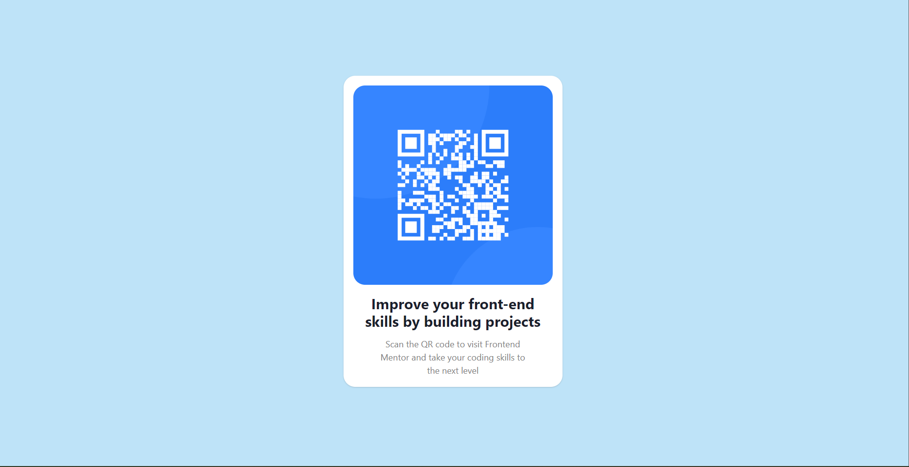

# Frontend Mentor - QR code component solution

This is a solution to the [QR code component challenge on Frontend Mentor](https://www.frontendmentor.io/challenges/qr-code-component-iux_sIO_H). Frontend Mentor challenges help you improve your coding skills by building realistic projects.

## Table of contents
- [Overview](#overview)
   - [Screenshot](#screenshot)
   - [Links](#links)
- [My process](#my-process)
   - [Built with](#built-with)
   - [What I learned](#what-i-learned)
## Overview
### Screenshot

### Links

- Solution URL: 

- Live Site URL: 

## My process

I started with a new React (Typescript + Vite) project, and incorporated in a centered element, the provided qr image, into a card element (using the [Chakra UI library](https://chakra-ui.com/)).

### Built with

- [React](https://reactjs.org/)
- [Typescript](https://www.typescriptlang.org/)
- [Chakra UI](https://chakra-ui.com/)

### What I learned

Mainly, I've learned two things:
- How to handle (although superficially), the Chakra UI library.

- Implement some responsive design through Breakpoints.

## Author

- Website - [David De Los Santos](https://dev-portafolio-three.vercel.app/).

- Frontend Mentor - [@dsaints2344](https://www.frontendmentor.io/profile/dsaints2344)